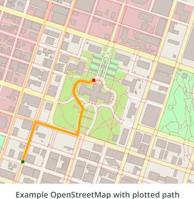

#  OpenStreetMap RoutePlanner

### Introduction
In this project, we will write a program in C++ using real [**OpenStreetMap data**](https://www.openstreetmap.org/#map=6/46.449/2.210)__ and __A* search__ to find a path between two points, just as we might see in a desktop or mobile mapping application.

<p align="center"> 
     
</p>

## Getting Started

1. OpenStreetMap Data

OpenStreetMap data that we used for this project comes in the form of an OSM XML file (*.osm file*). Nodes, ways and relations are some of the fundamental building blocks of OSM data files.

2. Data Types Overview

- A [node](https://wiki.openstreetmap.org/wiki/Node) is one of the most basic elements in the OpenStreetMap data model. Each node indicates a single point with an identifier `id`, latitude `lat`, and longitude `lon`.

- A [way](https://wiki.openstreetmap.org/wiki/Way) is an ordered list of nodes that represents a feature in the map. This feature could be a road, or a boundary of a park, or some other feature in the map. Each way has at least one `tag` which denotes some information about the way, and each way also belongs to at least one relation, which is described below.

- A [relation](https://wiki.openstreetmap.org/wiki/Relation) is a data structure which documents a relationship between other data elements.

## Instructions

Both the code to parse the OSM data and the data structures which are used to store the data in your program have already been written in the [IO2D OpenStreetMap example](https://github.com/cpp-io2d/P0267_RefImpl/tree/master/P0267_RefImpl/Samples/maps).

### Cloning

When cloning this project, be sure to use the `--recurse-submodules` flag. Using HTTPS:
```
git clone https://github.com/nalbert9/OSM_Route_Planner.git --recurse-submodules
```

### Dependencies for Running Locally
* cmake >= 3.11.3
  * All OSes: [click here for installation instructions](https://cmake.org/install/)
* make >= 4.1 (Linux, Mac), 3.81 (Windows)
  * Linux: make is installed by default on most Linux distros
  * Mac: [install Xcode command line tools to get make](https://developer.apple.com/xcode/features/)
  * Windows: [Click here for installation instructions](http://gnuwin32.sourceforge.net/packages/make.htm)
* gcc/g++ >= 7.4.0
  * Linux: gcc / g++ is installed by default on most Linux distros
  * Mac: same instructions as make - [install Xcode command line tools](https://developer.apple.com/xcode/features/)
  * Windows: recommend using [MinGW](http://www.mingw.org/)
* IO2D
  * Installation instructions for all operating systems can be found [here](https://github.com/cpp-io2d/P0267_RefImpl/blob/master/BUILDING.md)
  * This library must be built in a place where CMake `find_package` will be able to find it

### Compiling and Running

#### Compiling
To compile the project, first, create a `build` directory and change to that directory:
```
mkdir build && cd build
```
From within the `build` directory, then run `cmake` and `make` as follows:
```
cmake ..
make
```
#### Running
The executable will be placed in the `build` directory. From within `build`, you can run the project as follows:
```
./OSM_A_star_search
```
Or to specify a map file:
```
./OSM_A_star_search -f ../<your_osm_file.osm>
```

### Testing

The testing executable is also placed in the `build` directory. From within `build`, you can run the unit tests as follows:
```
./test
```
